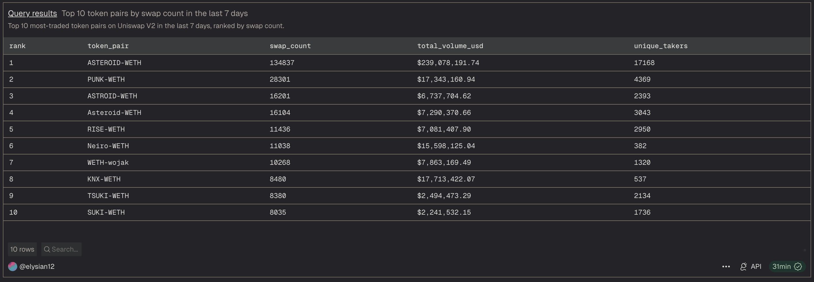

# Extra Credit

## Part 1 — Uniswap V2 USDC/WETH pool - Etherscan

Pool address: [`0xB4e16d0168e52d35CaCD2c6185b44281Ec28C9Dc`](https://etherscan.io/address/0xb4e16d0168e52d35cacd2c6185b44281ec28c9dc)

### 1.1 Recent Swap events

Five recent `Swap` events captured from the Events tab on Etherscan:


### 1.2 Chosen swap

Picking the most recent capture (screenshot 5) of Swap Event: block **24980168**,
_2026-04-28 17:50:59 UTC_, method `0xc7a76969`, logIndex `367`.

**Tx hash**: `0xe685aea4597c529f1a37bbb9cd2c962c198e980db1491387b928c1b4146d90fc`
**Event link**: `https://etherscan.io/tx/0xe685aea4597c529f1a37bbb9cd2c962c198e980db1491387b928c1b4146d90fc#eventlog#367`

| Field        | Value                                        |
| ------------ | -------------------------------------------- |
| `sender`     | `0x7f54F05635d15Cde17A49502fEdB9D1803A3Be8A` |
| `amount0In`  | `150077090`                                  |
| `amount1In`  | `0`                                          |
| `amount0Out` | `0`                                          |
| `amount1Out` | `65460521380972534`                          |
| `to`         | `0x7f54F05635d15Cde17A49502fEdB9D1803A3Be8A` |

> `sender == to` the same address that initiated the swap is also the recipient, indicating it is a type of router. Looking into the address shows it is a `0x Mainnet Settler` contract, deployed by `deployer.zeroexprotocol.eth`. This is a **0x Protocol Dex Aggregator Settler Contract**.

### 1.3 Tokens

| Slot     | Address                                                                                                               | Symbol | Decimals |
| -------- | --------------------------------------------------------------------------------------------------------------------- | ------ | -------- |
| `token0` | [`0xA0b86991c6218b36c1d19D4a2e9Eb0cE3606eB48`](https://etherscan.io/token/0xA0b86991c6218b36c1d19D4a2e9Eb0cE3606eB48) | USDC   | 6        |
| `token1` | [`0xC02aaA39b223FE8D0A0e5C4F27eAD9083C756Cc2`](https://etherscan.io/token/0xC02aaA39b223FE8D0A0e5C4F27eAD9083C756Cc2) | WETH   | 18       |

### 1.4 Human-readable amounts

`human-readable = raw / 10^decimals`

- `amount0*` → USDC, **6 decimals**
- `amount1*` → WETH, **18 decimals**

| Field        | Raw                 | Human-readable                |
| ------------ | ------------------- | ----------------------------- |
| `amount0In`  | `150077090`         | **150.077090 USDC**           |
| `amount1In`  | `0`                 | 0 WETH                        |
| `amount0Out` | `0`                 | 0 USDC                        |
| `amount1Out` | `65460521380972534` | **0.065460521380972534 WETH** |

**Direction**: USDC in → WETH out. The router sold **150.077090 USDC** and received **0.065460521380972534 WETH**.

```
price = 150.077090 USDC / 0.065460521380972534 WETH
      ≈ $2,292.6351 per WETH
```

---

## Part 2 — Dune Analytics queries on `uniswap_v2_ethereum.trades`

- Window: rolling **last 7 days** from query run time.
- Dataset: `uniswap_v2_ethereum.trades`.
- Result Run: _2026-04-22 01:28_

### 2.1 Combined query — top 10 pairs + USD volume + unique takers

```sql
-- Last 7 days, Uniswap V2 on Ethereum
SELECT
    ROW_NUMBER() OVER (ORDER BY COUNT(*) DESC) AS rank,
    token_pair,
    COUNT(*) AS swap_count,
    format('$%,.2f', SUM(amount_usd)) AS total_volume_usd,
    COUNT(DISTINCT taker) AS unique_takers
FROM uniswap_v2_ethereum.trades
WHERE block_time >= NOW() - INTERVAL '7' DAY
GROUP BY token_pair
ORDER BY COUNT(*) DESC
LIMIT 10;
```

### **Dune query URL**: <https://dune.com/elysian12/top-10-token-pairs-by-swap-count>


