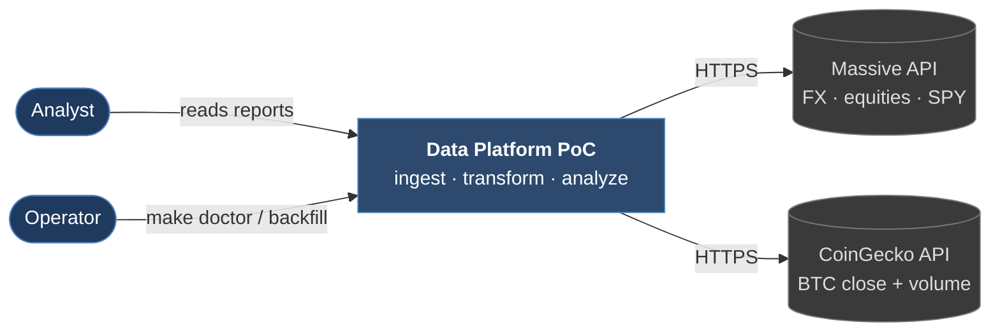
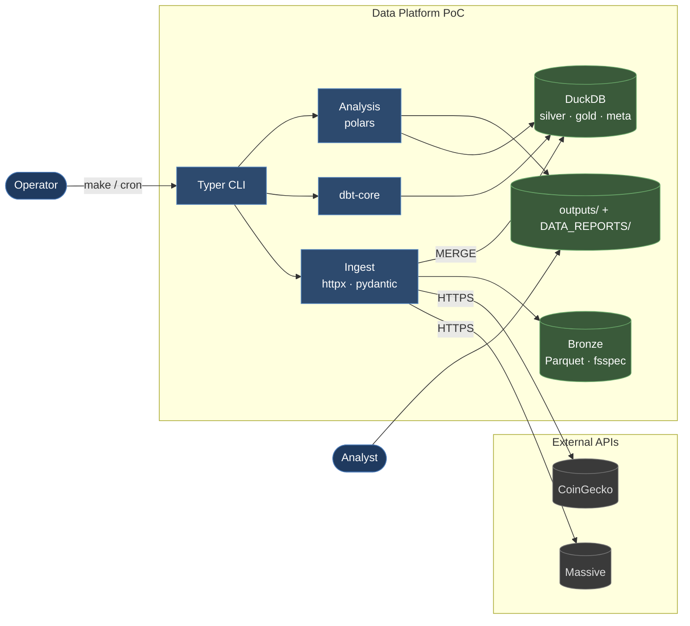
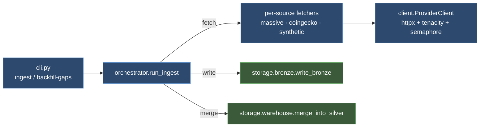
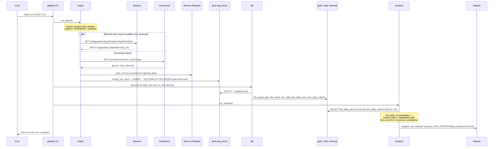

# Architecture

C4 context + container views of the Traditional Assets vs Bitcoin pipeline.
Module-level detail (C4 Code) lives inline with the source in
[src/pipeline/](../src/pipeline/).

---

## C4 Level 1 — System context

---

## C4 Level 2 — Containers

| Container | Tech | Role |
| --- | --- | --- |
| **Typer CLI** | Python 3.12 | Orchestrates ingest → transform → analyze; `make doctor`; backfills |
| **Ingest** | httpx + tenacity + pydantic v2 | Async fetch, per-provider semaphore, 429 backoff |
| **Bronze** | Parquet via fsspec | Hive-partitioned `source/asset_type/ingested_date`; idempotent overwrite |
| **DuckDB** | Embedded OLAP | `silver.stg_prices` (MERGE), `gold.*` (dbt), `meta.*` (run + DQ history) |
| **dbt-core** | dbt-duckdb adapter | Silver views, gold star schema, tests, lineage |
| **Analysis** | polars | Reads gold facts; window aggregates; DCA / lump-sum simulations |
| **Outputs** | Filesystem | `outputs/*.csv + *.parquet`; `DATA_REPORTS/*.md + *.html` |

---

## C4 Level 3 — Component view (ingest container)

`run_ingest` runs four steps in order: **resolve window** (explicit > incremental > lookback) → **fetch** (per-provider, gathered concurrently) → **write bronze** (partitioned Parquet) → **merge silver** (`INSERT … ON CONFLICT DO UPDATE`). Run state persists to `meta.pipeline_runs` via `RunContext`; structured events log to `logs/pipeline-*.log` via `get_logger()`.

---

## Data flow — single daily run

---

## Medallion layering

| Layer      | Storage                                                        | Owned by                                                     | Idempotency                                                                                                                           |
| ---------- | -------------------------------------------------------------- | ------------------------------------------------------------ | ------------------------------------------------------------------------------------------------------------------------------------- |
| **Bronze** | Parquet — `source=X/asset_type=Y/ingested_date=Z/data.parquet` | `pipeline/storage/bronze.py`                                 | Deterministic path — re-runs **overwrite** the same file. `ingested_at` + `run_id` as in-row columns preserve audit.                  |
| **Silver** | `silver.stg_prices` (DuckDB)                                   | `pipeline/storage/warehouse.py` via `INSERT ... ON CONFLICT` | Last-write-wins on `ingested_at`; identical batch replays are no-ops.                                                                 |
| **Gold**   | `gold.dim_*`, `gold.fact_*` (dbt models)                       | dbt                                                          | `fact_daily_price` is incremental on `(asset_id, date_id)`; `fact_daily_metrics` is full-rebuild because window functions require it. |
| **Meta**   | `meta.pipeline_runs`, `meta.fact_data_quality_runs`            | `pipeline/observability/run_tracker.py`                      | Append-only.                                                                                                                          |

---

## Deployment topologies

### Demo (what you run locally)

- Everything in-process. DuckDB is an embedded library (no daemon).
- Bronze is the local filesystem (`./data/bronze/`).
- `make run` serializes `ingest → dbt run → dbt test → analyze`.

### Production (documented, not deployed here)

- Bronze → S3 (flip `BRONZE_URI=s3://…`). fsspec + pyarrow handle the switch.
- Warehouse → ClickHouse (`dbt-clickhouse` profile; MergeTree engine with
  `ORDER BY (asset_id, date_id)`).
- Orchestrator → Airflow. Module entrypoints map 1:1 to tasks.
- Secrets → AWS Secrets Manager / Vault; not `.env`.
- Monitoring → ship `structlog` JSON to Loki / Elasticsearch; alert on DQ
  failures via PagerDuty.

See the ADRs in [decisions/](decisions/) for the rationale behind each choice.
