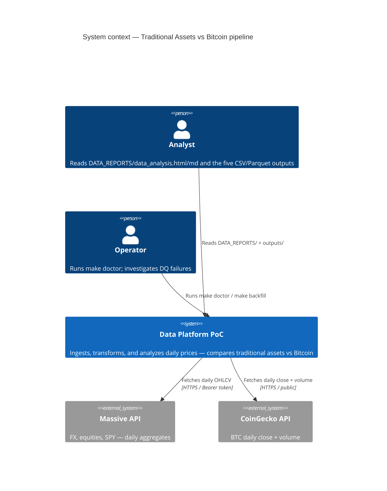
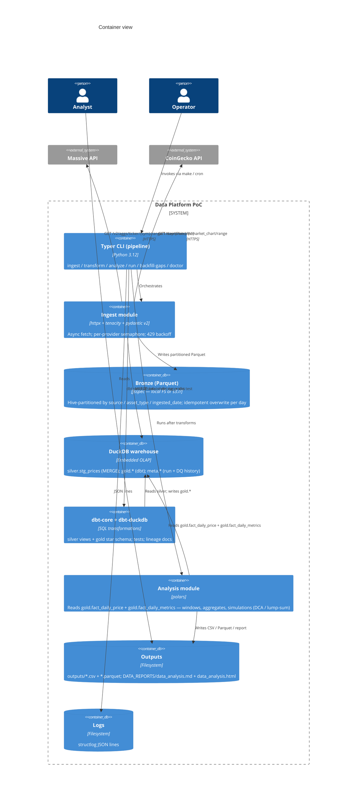
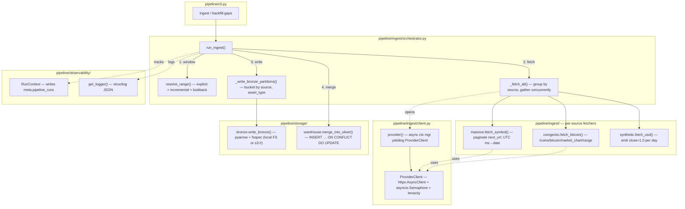

# Architecture

C4 context + container views of the Traditional Assets vs Bitcoin pipeline.
Module-level detail (C4 Code) lives inline with the source in
[src/pipeline/](../src/pipeline/).

---

## C4 Level 1 — System context



---

## C4 Level 2 — Containers



---

## C4 Level 3 — Component view (ingest container)

Solid arrow = calls / data flow. Dashed arrow = depends on / uses.



---

## Data flow — single daily run

```mermaid
sequenceDiagram
    participant Cron
    participant CLI as pipeline CLI
    participant Ingest
    participant Massive
    participant CoinGecko
    participant Bronze as Bronze (Parquet)
    participant Silver as silver.stg_prices
    participant dbt
    participant Gold as gold.* (star schema)
    participant Analysis
    participant Outputs

    Cron->>CLI: make run (02:00 UTC)
    CLI->>Ingest: run_ingest()
    Note over Ingest: resolve_range() picks window:<br/>explicit > incremental > lookback
    par Massive fetch (asyncio.gather over symbols)
        Ingest->>Massive: GET /v2/aggs/ticker/{sym}/range/1/day/{from}/{to}
        Massive-->>Ingest: OHLCV aggregates (paginated next_url)
    and CoinGecko fetch
        Ingest->>CoinGecko: GET /coins/bitcoin/market_chart/range
        CoinGecko-->>Ingest: {prices, total_volumes}
    end
    Ingest->>Bronze: write_bronze (overwrite by ingested_date)
    Ingest->>Silver: merge_into_silver — INSERT … ON CONFLICT DO UPDATE (last-write-wins)
    CLI->>dbt: dbt seed (if stale) + dbt run + dbt test
    dbt->>Silver: SELECT * (staging view)
    dbt->>Gold: dim_asset_type, dim_asset, dim_date, fact_daily_price, fact_daily_metrics
    CLI->>Analysis: run_analysis()
    Analysis->>Gold: SELECT fact_daily_price (close series) + fact_daily_metrics (precomputed returns / vol)
    Note over Analysis: No metric recomputation —<br/>analysis filters / aggregates gold,<br/>then runs DCA + lump-sum simulations.
    Analysis->>Outputs: outputs/*.csv + *.parquet; DATA_REPORTS/data_analysis.md + data_analysis.html
    CLI-->>Cron: exit 0 (or non-zero on failure)
```

---

## Medallion layering

| Layer      | Storage                                                        | Owned by                                                     | Idempotency                                                                                                                           |
| ---------- | -------------------------------------------------------------- | ------------------------------------------------------------ | ------------------------------------------------------------------------------------------------------------------------------------- |
| **Bronze** | Parquet — `source=X/asset_type=Y/ingested_date=Z/data.parquet` | `pipeline/storage/bronze.py`                                 | Deterministic path — re-runs **overwrite** the same file. `ingested_at` + `run_id` as in-row columns preserve audit.                  |
| **Silver** | `silver.stg_prices` (DuckDB)                                   | `pipeline/storage/warehouse.py` via `INSERT ... ON CONFLICT` | Last-write-wins on `ingested_at`; identical batch replays are no-ops.                                                                 |
| **Gold**   | `gold.dim_*`, `gold.fact_*` (dbt models)                       | dbt                                                          | `fact_daily_price` is incremental on `(asset_id, date_id)`; `fact_daily_metrics` is full-rebuild because window functions require it. |
| **Meta**   | `meta.pipeline_runs`, `meta.fact_data_quality_runs`            | `pipeline/observability/run_tracker.py`                      | Append-only.                                                                                                                          |

---

## Deployment topologies

### Demo (what you run locally)

- Everything in-process. DuckDB is an embedded library (no daemon).
- Bronze is the local filesystem (`./data/bronze/`).
- `make run` serializes `ingest → dbt run → dbt test → analyze`.

### Production (documented, not deployed here)

- Bronze → S3 (flip `BRONZE_URI=s3://…`). fsspec + pyarrow handle the switch.
- Warehouse → ClickHouse (`dbt-clickhouse` profile; MergeTree engine with
  `ORDER BY (asset_id, date_id)`).
- Orchestrator → Airflow. Module entrypoints map 1:1 to tasks.
- Secrets → AWS Secrets Manager / Vault; not `.env`.
- Monitoring → ship `structlog` JSON to Loki / Elasticsearch; alert on DQ
  failures via PagerDuty.

See the ADRs in [decisions/](decisions/) for the rationale behind each choice.
